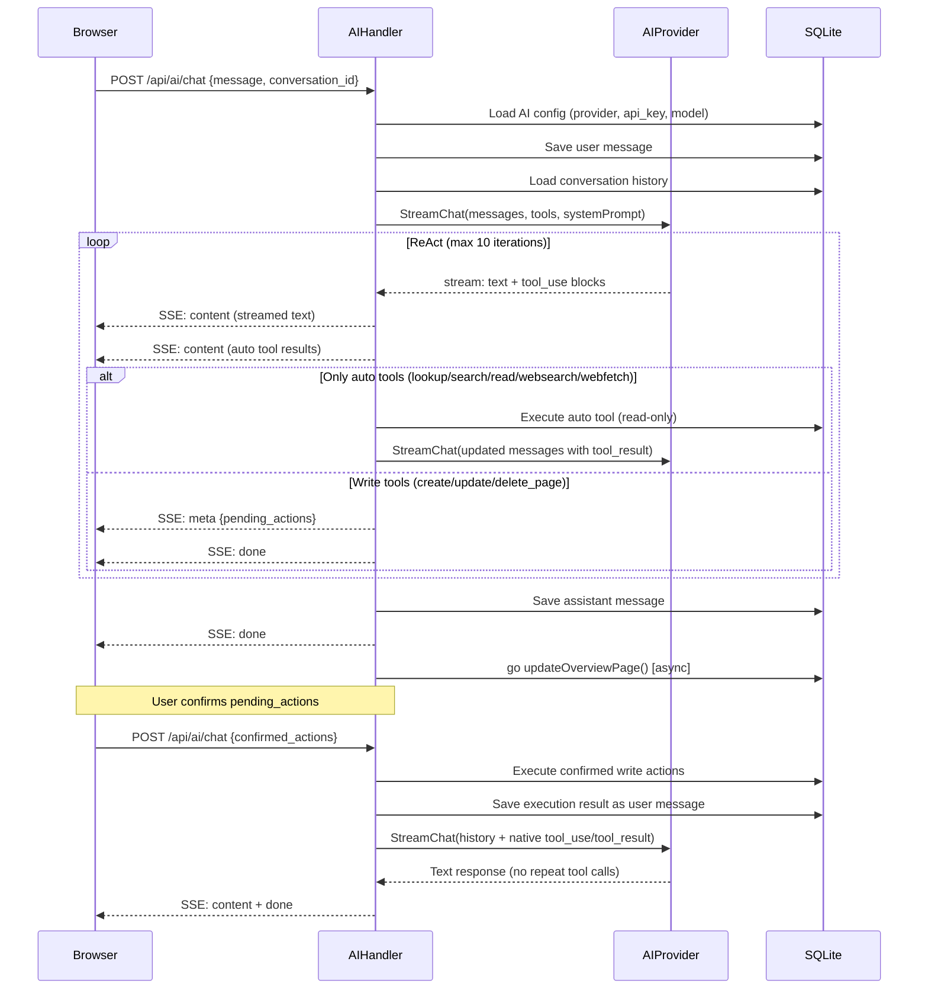
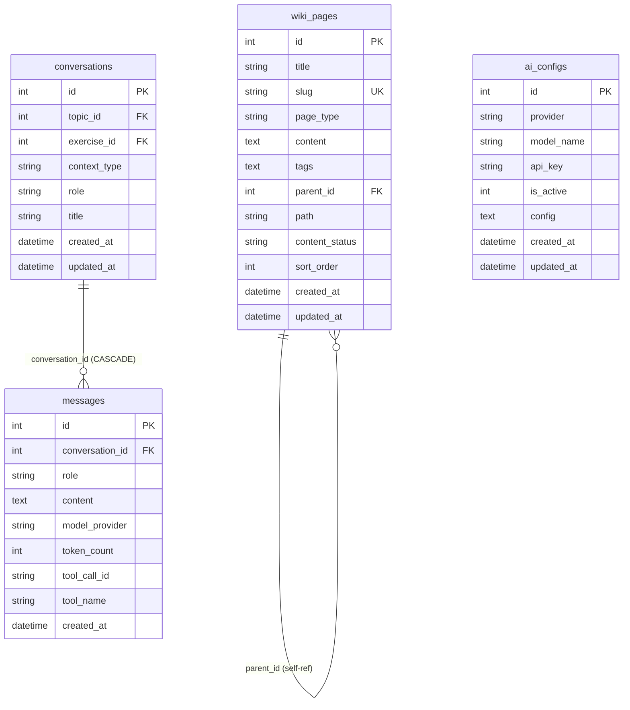

# ARCHITECTURE.md

LLM Wiki — 单用户本地 AI 知识库。用户通过对话让 AI 读写知识树，写入操作需前端确认后执行。

不在本文范围：行为规则见 CLAUDE.md，构建/运行/配置见 README，决策史见 openspec/。

## 全局图

```
┌─────────────────────────────────────────────────────────────────┐
│  Browser (localhost:3000)                                       │
│  ┌─────────────┐ ┌───────────────┐ ┌────────────────────────┐ │
│  │KnowledgeTree│ │  PageViewer   │ │      ChatPanel         │ │
│  │  (tree nav) │ │ (wiki content)│ │ (SSE stream + confirm) │ │
│  └──────┬──────┘ └───────┬───────┘ └───────────┬────────────┘ │
│         │                │                     │              │
│         └────────────────┼─────────────────────┘              │
│                          │ REST + SSE                          │
└──────────────────────────┼─────────────────────────────────────┘
                           │
┌──────────────────────────┼─────────────────────────────────────┐
│  Go HTTP Server (:8080)  │                                     │
│  ┌─────────── Chi Router ───────────────────────────────────┐ │
│  │  Middleware: Logger · Recoverer · CORS(localhost:3000)   │ │
│  └─────────────────────────────────────────────────────────┘ │
│                          │                                     │
│  ┌───────────┐   ┌──────┴──────┐                              │
│  │WikiHandler│   │  AIHandler  │                              │
│  │ (CRUD+tree│   │ (ReAct loop │                              │
│  │  rename   │   │  + confirm) │                              │
│  │  move)    │   │             │                              │
│  └─────┬─────┘   └──┬────┬────┘                              │
│        │            │    │                                    │
│  ┌─────┴─────┐   ┌──┴──┐ │  ┌──────────────┐                │
│  │model/      │   │ai/  │ │  │ go updateOv- │                │
│  │Queries     │   │Pro- │ │  │ erviewPage() │                │
│  │(sqlc)      │   │vider│ │  └──────┬───────┘                │
│  └─────┬─────┘   └──┬──┘ │         │                        │
│        │            │    │         │                        │
│  ┌─────┴────────────┴────┴─────────┴───────┐                │
│  │           SQLite (WAL, MaxOpenConns=1)   │                │
│  │  wiki_pages · conversations · messages   │                │
│  │  ai_configs · topics · exercises         │                │
│  │  learning_records                        │                │
│  └──────────────────────────────────────────┘                │
│                     │                                         │
└─────────────────────┼─────────────────────────────────────────┘
                      │ 出站
        ┌─────────────┼─────────────────┐
        │             │                 │
   ┌────┴────┐  ┌─────┴─────┐  ┌───────┴──────┐
   │ Claude  │  │ DeepSeek  │  │    Tavily    │
   │ Messages│  │ Chat Comp.│  │ Search API   │
   │ API     │  │ (OpenAI)  │  │              │
   └─────────┘  └───────────┘  └──────────────┘
```

要点：系统是单进程两层结构（React SPA → Go HTTP server → SQLite + 外部 AI API），核心复杂度集中在 AIHandler 的 ReAct 循环和用户确认流程。

## 分层架构

| 层 | 目录 | 职责 | 跨层禁止 |
|---|---|---|---|
| HTTP 入口 | `cmd/server/` | 启动、路由注册、schema 初始化 | 不含业务逻辑 |
| Handler | `internal/handler/` | 请求解析、响应序列化、ReAct 循环编排 | 不直接操作 AI provider 的 HTTP 细节 |
| AI Provider | `internal/ai/` | AI API 调用、SSE 解析、tool 定义 | 不访问 DB |
| Data | `internal/model/` | sqlc 生成的类型安全查询 | 不含业务逻辑 |
| Frontend | `frontend/src/` | UI 渲染、SSE 消费、用户确认交互 | 不直接调 AI API |

Handler 层同时持有 `*sql.DB`（直接 SQL）和 `*model.Queries`（sqlc），部分查询（conversation CRUD、消息插入）直接写 SQL 而非走 sqlc。

## 核心抽象

**AIProvider** (`internal/ai/provider.go`)

`Chat` / `StreamChat` 两个方法，`StreamChat` 返回 `<-chan ChatChunk`。两个实现——ClaudeProvider 和 DeepSeekProvider——分别解析自家 SSE 格式。`NewProvider` 工厂按 provider 类型分发。AI 层不持有状态、不访问 DB，每次调用由 Handler 传入完整的 ChatRequest。

**ReAct Loop** (`internal/handler/ai.go:AIChat`)

AIHandler.AIChat 实现了一个最多 10 轮的推理-行动循环：AI 流式输出文本 + tool_use → Handler 区分自动工具和写入工具 → 自动工具立即执行、结果注入上下文 → 写入工具打包为 pending_actions 返回前端 → 用户确认后再次调用 AIChat（带 confirmed_actions）→ Handler 执行写入、注入 tool_result → AI 继续推理或结束。

**Materialized Path** (`wiki_pages.path`)

树形结构用物化路径表示（如 `"1/5/12/"`），支持 O(1) 子树查询（`LIKE prefix%`）和批量路径迁移（`REPLACE(path, old, new)`）。自引用 `parent_id` FK 用于直接子节点查询，`path` 用于子树操作。

## 控制流拓扑

**入口表**

| 入口 | 方法 | 路径 | Handler |
|---|---|---|---|
| Wiki 树 | GET | `/api/wiki` | WikiHandler.GetWikiTree |
| Wiki 页面 | GET | `/api/wiki/{slug}` | WikiHandler.GetWikiPageBySlug |
| Wiki 概览 | GET | `/api/wiki/overview` | WikiHandler.GetOverviewPage |
| 创建页面 | POST | `/api/wiki` | WikiHandler.CreateWikiPage |
| 更新页面 | PUT | `/api/wiki/{id}` | WikiHandler.UpdateWikiPage |
| 删除页面 | DELETE | `/api/wiki/{id}` | WikiHandler.DeleteWikiPage |
| 重命名 | PATCH | `/api/wiki/{id}/rename` | WikiHandler.RenameWikiPage |
| 移动 | PATCH | `/api/wiki/{id}/move` | WikiHandler.MoveWikiPage |
| 快速创建 | POST | `/api/wiki/quick-create` | WikiHandler.CreateEmptyWikiPage |
| AI 对话 | POST | `/api/ai/chat` | AIHandler.AIChat (SSE) |
| 文件上传 | POST | `/api/ai/upload` | AIHandler.UploadFile |
| 会话列表 | GET | `/api/ai/conversations` | AIHandler.ListConversations |
| 创建会话 | POST | `/api/ai/conversations` | AIHandler.CreateConversation |
| 更新标题 | PATCH | `/api/ai/conversations/{id}` | AIHandler.UpdateConversationTitle |
| 删除会话 | DELETE | `/api/ai/conversations/{id}` | AIHandler.DeleteConversation |
| 会话消息 | GET | `/api/ai/conversations/{id}/messages` | AIHandler.GetConversationMessages |
| AI 配置 | GET | `/api/ai/configs` | AIHandler.GetAIConfigs |
| 保存配置 | POST | `/api/ai/configs` | AIHandler.UpsertAIConfig |
| 健康检查 | GET | `/health` | inline |

**AI Chat 时序**



看图要点：确认流程是两次独立的 HTTP 请求。第一次返回 pending_actions，前端展示确认 UI；用户确认后第二次请求带 confirmed_actions，Handler 将它们转换为原生的 tool_use/tool_result 对注入入对话历史，使 AI 看到操作已执行完毕。

## 数据流拓扑



关键不变量：
- `wiki_pages.slug` 全局唯一（UK 约束）
- `wiki_pages.path` 是从根到自身的 ID 路径（如 `"1/5/12/"`），子树查询和移动操作依赖此字段
- `ai_configs` 同一时刻只有一个 `is_active=1` 的记录（应用层保证：upsert 时先 deactivate all）
- `messages.content` 对 assistant 角色可能是纯文本，也可能是 JSON 数组（ContentBlock[]，含 tool_use/tool_result 结构）
- `topics`、`exercises`、`learning_records` 是遗留表，当前活跃写入仅走 `wiki_pages`

## 入站/出站通道模型

```
入站通道                          出站通道
─────────                        ─────────
Browser REST ───► Chi Router ───► SQLite (读/写)
  (JSON)          (/:8080)

Browser SSE ◄──── AIHandler  ───► Claude API
  (text/event-    (stream     │   (api.anthropic.com)
   stream)         response)   │
                              ├──► DeepSeek API
                              │   (api.deepseek.com)
                              │
                              └──► Tavily API
                                  (api.tavily.com/search)
```

入站只有一条：浏览器对 `:8080` 的 HTTP 请求，其中 AI Chat 端点使用 SSE 流式响应。

出站三条：Claude/DeepSeek（AI 生成）、Tavily（websearch 工具）。webfetch 工具直接 HTTP GET 目标 URL，不走 Tavily。

## 并发与一致性模型

**长时 goroutine 清单**

```
┌─────────────────────────────────────────┐
│ go updateOverviewPage()                 │
│ 触发: 每次 AIChat 完成 (wiki_maintainer)│
│ 语义: 后台重算概览页统计数据并写入 DB   │
│ 生命周期: fire-and-forget               │
└─────────────────────────────────────────┘
```

**SQLite 并发控制**

- `MaxOpenConns(1)` — 单连接串行化所有写操作
- WAL 模式 — 允许并发读不阻塞写
- `busy_timeout=5000` — 写冲突时等待 5 秒而非立即报错
- `updateOverviewPage()` 在独立 goroutine 中运行，与主请求共享同一个 `*sql.DB`，依赖 `MaxOpenConns(1)` 保证不并发写

**幂等层级**

| 操作 | 幂等性 | 机制 |
|---|---|---|
| AI config upsert | 幂等 | deactivate-all + upsert by provider |
| wiki page create | 非幂等 | slug UK 约束防重复 |
| wiki page update | 幂等 | 全字段覆盖写 |
| wiki page delete | 幂等 | 删除不存在的行无副作用 |
| confirmed actions 执行 | 非幂等 | 无去重，前端需防止重复提交 |
| overview 更新 | 幂等 | 全量重写 |

**事务边界**

当前没有显式事务。每个 sqlc 查询和直接 SQL 调用都是独立的自动提交事务。MoveWikiPage 中的路径迁移（更新自身路径 + 批量更新子节点路径）不是原子的——如果中间失败，部分子节点路径会不一致。

## 失败语义模型

| 路径 | 策略 | 行为 |
|---|---|---|
| AI provider 调用失败 | fail-fast | SSE 发送 error 事件，结束流 |
| Tavily / webfetch 失败 | fail-open | 返回错误文本作为工具结果，AI 继续推理 |
| SQLite 写入失败 | fail-fast | HTTP 500，操作不执行 |
| updateOverviewPage 失败 | 静默 | log.Printf 记录，不影响主流程 |
| SSE 写入中断 | 静默 | 客户端断开后 flusher 继续工作，goroutine 自然结束 |
| confirmed action 部分失败 | 部分成功 | 逐个执行，失败项返回错误文本但仍继续后续操作 |

## Bootstrap 与运行时形状

**启动顺序**

```
1. 读取 DB_PATH 环境变量 (默认 learn-helper.db)
2. sql.Open + WAL + MaxOpenConns(1) + busy_timeout(5000)
3. db.Exec(schemaSQL) — CREATE TABLE IF NOT EXISTS 全部 6 张表 + 索引
4. db.Exec — INSERT OR IGNORE 概览页 (slug='overview')
5. NewWikiHandler(db), NewAIHandler(db)
6. chi.NewRouter + Logger + Recoverer + CORS
7. 注册 /health, /api/wiki/*, /api/ai/* 路由
8. 读取 PORT 环境变量 (默认 8080)
9. http.ListenAndServe
```

**关停顺序**

无优雅关停。`http.ListenAndServe` 返回时 `defer db.Close()` 执行。进行中的 SSE 流和 `updateOverviewPage()` goroutine 随进程终止。

## 信任边界

```
┌─ 不可信 ─────────────────────────────┐
│  Browser (localhost:3000)             │
│  - 所有输入需校验                      │
│  - CORS 限制 localhost:3000           │
└───────────────────────────────────────┘
                  │
┌─ 内网 ───────────────────────────────┐
│  Go Server (localhost:8080)           │
│  - 无认证，单用户假定                  │
│  - AI API key 明文存储于 ai_configs   │
└───────────────────────────────────────┘
                  │
┌─ 出站身份 ───────────────────────────┐
│  Claude API  — api_key in header      │
│  DeepSeek   — api_key in header      │
│  Tavily     — api_key in body        │
│  webfetch   — User-Agent: LLMWiki/1.0│
└───────────────────────────────────────┘
```

系统无认证层，假定单用户本地使用。API key 以明文存储在 SQLite 中。CORS 只允许 `localhost:3000`，是唯一的安全边界。

## 结构性不变量

1. `wiki_pages.slug` 全局唯一 — `CREATE UNIQUE INDEX`
2. `ai_configs` 同一时刻最多一条 `is_active=1` — 应用层 deactivate-all + upsert
3. `wiki_pages.path` 始终等于从根到自身的 ID 路径 — 由 CreateWikiPage / MoveWikiPage 维护
4. `messages.content` 中 assistant 消息若含 `[操作建议]`，则尾随的 pending action 详情与前端确认流程对应
5. `wiki_pages.parent_id → wiki_pages.id` 自引用关系不构成环 — MoveWikiPage 用 `strings.HasPrefix(newPath, page.Path)` 防止移动到自身后代下
6. ReAct 循环最多 10 轮 — `const maxIterations = 10`
7. 写入工具 (create/update/delete_page) 不在 ReAct 循环内自动执行 — 必须经前端确认后通过 `confirmed_actions` 二次请求

验证命令：
```bash
# 1. slug 唯一
sqlite3 learn-helper.db "SELECT slug, COUNT(*) FROM wiki_pages GROUP BY slug HAVING COUNT(*) > 1"
# 2. 单 active config
sqlite3 learn-helper.db "SELECT COUNT(*) FROM ai_configs WHERE is_active = 1"
# 3. path 一致性（无孤儿路径）
sqlite3 learn-helper.db "SELECT id, path FROM wiki_pages WHERE parent_id IS NOT NULL AND path = ''"
# 5. 无环
sqlite3 learn-helper.db "SELECT p1.id FROM wiki_pages p1 JOIN wiki_pages p2 ON p1.parent_id = p2.id WHERE p2.parent_id = p1.id"
```

## 领域词汇

| 术语 | 项目内含义 | 备注 |
|---|---|---|
| page_type | `entity` / `concept` / `overview` | overview 有且仅有一页 |
| content_status | `empty` / `draft` / `published` | empty = 刚创建或内容被清空 |
| pending_action | AI 建议的写入操作，待用户确认 | type 为 create/update/delete |
| confirmed_action | 用户已确认的 pending_action | 前端原样回传 |
| auto tool | lookup_page / search_pages / read_page / websearch / webfetch | ReAct 循环内自动执行 |
| write tool | create_page / update_page / delete_page | 需用户确认 |
| path | 物化路径，如 `"1/5/12/"` | 非文件系统路径，是 ID 链 |
| wiki_maintainer | 唯一 AI role | 管理知识树，读写 wiki_pages |
