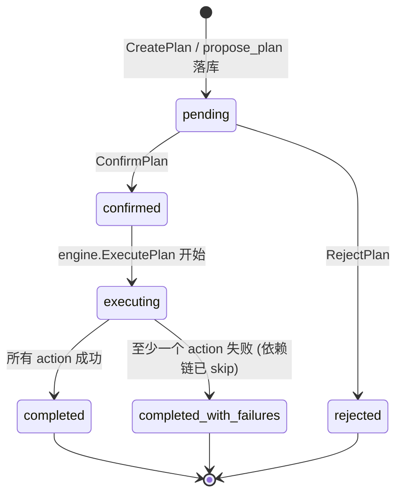
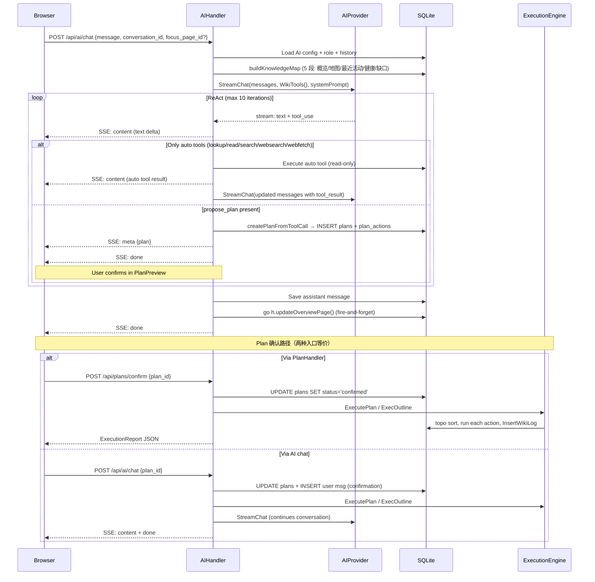
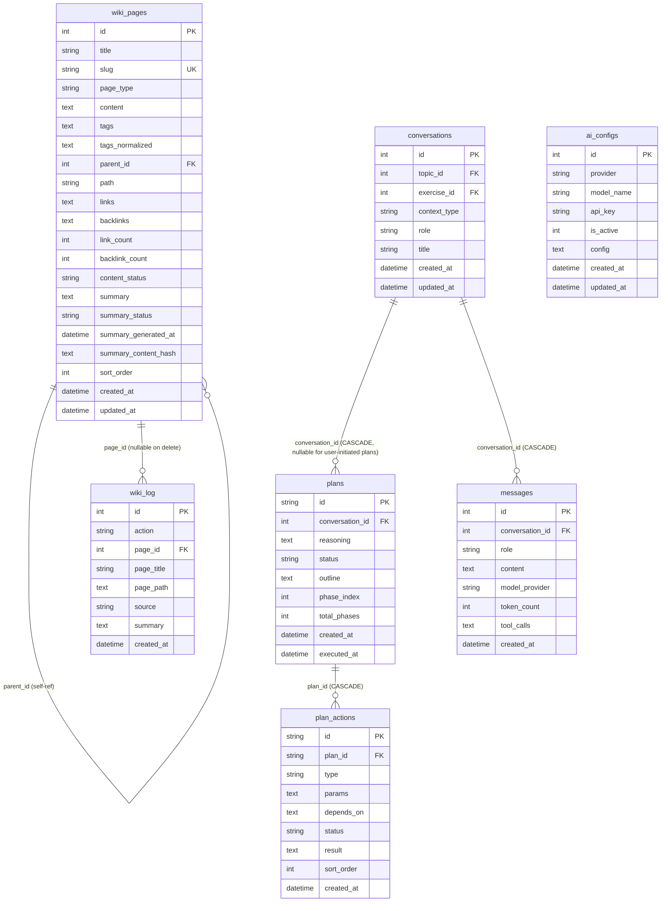

# ARCHITECTURE.md

LLM Wiki — 单用户本地 AI 知识库。用户通过对话让 AI 读写知识树，写入操作需前端确认后执行。

不在本文范围：行为规则见 CLAUDE.md，构建/运行/配置见 README，决策史见 openspec/。

## 全局图

```
┌─────────────────────────────────────────────────────────────────────┐
│  Browser (localhost:3000)                                            │
│  ┌──────────────┐ ┌────────────────┐ ┌──────────────┐ ┌───────────┐ │
│  │KnowledgeTree │ │ PageViewer +   │ │  ChatPanel   │ │PlanPreview│ │
│  │  (tree nav)  │ │ confirm bar    │ │  (SSE 消费)  │ │(plan 确认)│ │
│  └──────┬───────┘ └───────┬────────┘ └──────┬───────┘ └─────┬─────┘ │
│         └──────────────────┴────────────┬───┴───────────────┘       │
│                                           │ REST + SSE               │
└───────────────────────────────────────────┼───────────────────────────┘
                                            │
┌───────────────────────────────────────────┼───────────────────────────┐
│  Go HTTP Server (:8080)                   │                           │
│  ┌─────────── Chi Router ───────────────────────────────┐            │
│  │  Middleware: Logger · Recoverer · CORS(:3000)         │            │
│  │  Routes: /api/wiki/* · /api/ai/* · /api/plans/*       │            │
│  └──────────────────────────────────────────────────────┘            │
│                       │                                               │
│   ┌────────────┐  ┌───┴────────┐  ┌────────────┐                    │
│   │WikiHandler │  │ AIHandler  │  │PlanHandler │                    │
│   │ (CRUD+tree │  │ (ReAct     │  │ (plan CRUD │                    │
│   │  confirm)  │  │  loop +    │  │  + confirm │                    │
│   │            │  │  SSE)      │  │  + reject) │                    │
│   └──────┬─────┘  └──┬────┬────┘  └──────┬─────┘                    │
│          │           │    │              │                          │
│          │      ┌────┴────┴───┐  ┌───────┴──────────┐               │
│          │      │ai_renderer │  │   ExecutionEngine │               │
│          │      │(knowledge  │  │  (topo sort +     │               │
│          │      │ map, 5 段) │  │   placeholder +   │               │
│          │      └──────┬─────┘  │   link system +   │               │
│          │             │        │   wiki_log writes)│               │
│          │             │        └───────┬──────────┘               │
│          │             │                │                           │
│  ┌───────┴─────┐  ┌────┴─────┐   ┌─────┴──────┐                    │
│  │model/       │  │ ai/      │   │  worker/   │                    │
│  │Queries      │  │ Provider │   │  Summary-  │                    │
│  │(sqlc)       │  │(Claude/  │   │  Worker    │                    │
│  │             │  │ DeepSeek)│   │  (unused)  │                    │
│  └──────┬──────┘  └────┬─────┘   └─────┬──────┘                    │
│         │              │               │                           │
│  ┌──────┴──────────────┴───────────────┴──────┐                    │
│  │  SQLite (WAL, MaxOpenConns=1)                │                    │
│  │  wiki_pages · wiki_log · plans · plan_actions                    │
│  │  conversations · messages · ai_configs                            │
│  │  topics · exercises · learning_records  (legacy)                  │
│  └─────────────────────────────────────────────┘                    │
│                            │                                         │
└────────────────────────────┼─────────────────────────────────────────┘
                             │ 出站
            ┌────────────────┼────────────────┐
            │                │                │
       ┌────┴────┐     ┌─────┴─────┐    ┌─────┴─────┐
       │ Claude  │     │ DeepSeek  │    │  Tavily   │
       │ Messages│     │ Chat Comp.│    │ Search API│
       │ API     │     │ (OpenAI)  │    │           │
       └─────────┘     └───────────┘    └───────────┘
```

要点：单进程两层结构（React SPA → Go HTTP server → SQLite + 外部 AI API），核心复杂度集中在三处：AIHandler 的 ReAct 循环 + propose_plan 终止条件、ExecutionEngine 的拓扑排序 + wiki_log 写入链路、handler 层的双重确认机制（plan 确认 + 页面草稿确认）。SummaryWorker 已在 bootstrap 装配但当前无生产调用方。

## 分层架构

| 层 | 目录 | 职责 | 跨层禁止 |
|---|---|---|---|
| HTTP 入口 | `cmd/server/`（+ `cmd/migrate` / `cmd/initdb`） | 启动、路由注册、schema 初始化、worker 装配 | 不含业务逻辑 |
| Handler | `internal/handler/`（`wiki.go` / `ai.go` / `plan.go` / `ai_renderer.go`） | 请求解析、响应序列化、ReAct 循环编排、上下文渲染 | 不直接操作 AI provider 的 HTTP 细节 |
| Engine | `internal/engine/` | plan 执行的拓扑排序、占位符替换、链接/反链维护、wiki_log 写入 | 不直接处理 HTTP 请求 |
| Worker | `internal/worker/` | 异步 AI 摘要生成（SummaryWorker） | 不持有 HTTP 状态 |
| AI Provider | `internal/ai/` | AI API 调用、SSE 解析、tool 定义、system prompt 构造 | 不访问 DB |
| Data | `internal/model/` | sqlc 生成的类型安全查询 | 不含业务逻辑 |
| Frontend | `frontend/src/`（`components/` / `app/` / `lib/` / `types/` / `contexts/` / `styles/`） | UI 渲染、SSE 消费、PlanPreview / PageViewer 确认交互 | 不直接调 AI API |

Handler / Engine 两层都同时持有 `*sql.DB`（直接 SQL）和 `*model.Queries`（sqlc），部分查询（conversation CRUD、消息插入、plan 落库）直接写 SQL 而非走 sqlc。

## 核心抽象

**AIProvider** (`internal/ai/provider.go`)

`Chat` / `StreamChat` 两个方法，`StreamChat` 返回 `<-chan ChatChunk`。两个实现——ClaudeProvider 和 DeepSeekProvider——分别解析自家 SSE 格式。`NewProvider` 工厂按 provider 类型分发。AI 层不持有状态、不访问 DB，每次调用由 Handler 传入完整的 ChatRequest。`WikiTools()` 返回 AI 可调用的 6 个 tool 定义。

**ReAct Loop** (`internal/handler/ai.go:AIChat`)

AIHandler.AIChat 实现了一个最多 10 轮的推理-行动循环：AI 流式输出文本 + tool_use → Handler 区分 5 个 auto 工具（lookup/read/search/websearch/webfetch，立即执行）和 `propose_plan`（终止信号）→ auto 工具结果作为 `tool` 消息注入上下文继续迭代 → 遇 `propose_plan` 时解析为 `plans` 行 + 持久化到 DB → 通过 SSE `meta` 事件把 plan 推前端 `PlanPreview` 组件 → 用户在 `PlanPreview` 点确认后二次请求带 `plan_id`（或 `POST /api/plans/confirm`）→ `engine.ExecutePlan` 拓扑执行。

**ExecutionEngine** (`internal/engine/engine.go`)

`ExecutePlan(ctx, planID)` 是 plan 执行的唯一入口：`loadActions` → `topoSort`（Kahn 算法，检测环）→ 逐 action 跑 `executeAction`（dispatch 到 `execCreatePage` / `execUpdatePage` / `execDeletePage` / `execLinkPages` / `execMovePage`）→ 每步前 `replacePlaceholders` 替换 `{{action:ID.field}}` → 维护 wiki_pages 的 `links` / `backlinks` / `link_count` / `backlink_count` → 每条写入同步 `InsertWikiLog`。`ExecOutline` 是另一分支：仅 `outline` 无 `actions` 的 plan 走它，递归创建空骨架页。`plan.status` 终态由执行结果决定（`completed` 或 `completed_with_failures`）。

**SummaryWorker** (`internal/worker/summary.go`)

异步 AI 摘要生成器。`Run(ctx)` 单 goroutine 串行消费 buffered channel（cap=100），`Enqueue(pageID)` 非阻塞（队列满静默 drop）。`generateOne` 拿页 → 调 `provider.GenerateSummary`（200ms 速率限制）→ 写回 `summary` + `summary_status='ready'` 和 MD5 content-hash。`BackfillOnce(batchSize)` 扫 `summary_status IN ('pending','failed')`，启动时调用兜底。**当前状态：Enqueue 在生产代码中无调用方，MarkSummaryPending 也无调用方，worker 启动后实际空转，仅靠 BackfillOnce 处理历史遗留 — 此为已知未接通项。**

**Materialized Path** (`wiki_pages.path`)

树形结构用物化路径表示（如 `"1/5/12/"`），支持 O(1) 子树查询（`LIKE prefix%`）和批量路径迁移（`REPLACE(path, old, new)` 或 sqlc 的 `BatchUpdateWikiPagePath`）。自引用 `parent_id` FK 用于直接子节点查询，`path` 用于子树操作。**注意：当前有两套维护代码** —— `handler/wiki.go` 的手工 wiki handler（MoveWikiPage / CreateWikiPage），以及 `engine/engine.go` 的 plan 执行路径，两者各自重新计算 path。

**KnowledgeMapDB** (`internal/handler/ai_renderer.go:462`)

AI 入站 prompt 的主入口。由 `OverviewDB` / `KnowledgeMapTreeDB` / `RecentLogDB` / `HealthDB` / `GapsDB` 5 个子接口组成的复合接口。`buildKnowledgeMap` 串行渲染 5 段：概览统计 → 分类树（带每页摘要+反链数+标签）→ 全局标签索引 → 最近活动（来自 wiki_log）→ 结构健康检查（孤儿/重名/死页）→ 知识缺口（按顶层分类聚合空页）。`*model.Queries` 通过 `wikiContextDBAdapter` 适配该接口。

**WikiLog** (`wiki_log` table)

每次 wiki 写入的 append-only 审计日志。engine 的 `execCreatePage` / `execUpdatePage` / `execDeletePage` / `execLinkPages` / `execMovePage` 都同步写一条（`source='plan'`）；`WikiHandler` 的手工 POST/PUT/PATCH/DELETE 也各写一条（`source='manual'`）。AI 通过 `renderRecentLog` 把过去 7 天的日志作为上下文读入，是"知识地图"5 段中第 3 段。

## 控制流拓扑

**入口表**

| 入口 | 方法 | 路径 | Handler |
|---|---|---|---|
| Wiki 树 | GET | `/api/wiki` | WikiHandler.GetWikiTree |
| Wiki 页面 by slug | GET | `/api/wiki/{slug}` | WikiHandler.GetWikiPageBySlug |
| Wiki 页面 by id | GET | `/api/wiki/by-id` | WikiHandler.GetWikiPageByID |
| Wiki 概览 | GET | `/api/wiki/overview` | WikiHandler.GetOverviewPage |
| 创建页面 | POST | `/api/wiki` | WikiHandler.CreateWikiPage |
| 更新页面 | PUT | `/api/wiki/{id}` | WikiHandler.UpdateWikiPage |
| 草稿确认 | PUT | `/api/wiki/{id}/confirm` | WikiHandler.ConfirmPageContent |
| 删除页面 | DELETE | `/api/wiki/{id}` | WikiHandler.DeleteWikiPage |
| 重命名 | PATCH | `/api/wiki/{id}/rename` | WikiHandler.RenameWikiPage |
| 移动 | PATCH | `/api/wiki/{id}/move` | WikiHandler.MoveWikiPage |
| 快速创建 | POST | `/api/wiki/quick-create` | WikiHandler.CreateEmptyWikiPage |
| AI 对话 | POST | `/api/ai/chat` | AIHandler.AIChat (SSE) |
| 文件上传 | POST | `/api/ai/upload` | AIHandler.UploadFile |
| 会话列表 | GET | `/api/ai/conversations` | AIHandler.ListConversations |
| 创建会话 | POST | `/api/ai/conversations` | AIHandler.CreateConversation |
| 更新标题 | PATCH | `/api/ai/conversations/{id}` | AIHandler.UpdateConversationTitle |
| 删除会话 | DELETE | `/api/ai/conversations/{id}` | AIHandler.DeleteConversation |
| 会话消息 | GET | `/api/ai/conversations/{id}/messages` | AIHandler.GetConversationMessages |
| AI 配置 | GET | `/api/ai/configs` | AIHandler.GetAIConfigs |
| 保存配置 | POST | `/api/ai/configs` | AIHandler.UpsertAIConfig |
| 计划查询 | GET | `/api/plans` | PlanHandler.GetPlan |
| 用户直接创建计划 | POST | `/api/plans` | PlanHandler.CreatePlan |
| 计划确认 | POST | `/api/plans/confirm` | PlanHandler.ConfirmPlan |
| 计划拒绝 | POST | `/api/plans/reject` | PlanHandler.RejectPlan |
| 健康检查 | GET | `/health` | inline |

**Plan 状态机**



**AI Chat + Plan 确认时序**



看图要点：写入操作的"两次请求"形态保留下来，但语义从"逐 action 回传 confirmed_actions"变成"按 plan_id 二次请求触发整批执行"。`PlanHandler.ConfirmPlan` 和 `AIHandler.AIChat {plan_id}` 是**等价入口**——前者直接返回 ExecutionReport JSON，后者把结果注入 AI 流后继续对话（让 AI 总结执行结果）。Plan 内 action 之间支持 `depends_on` 拓扑排序和 `{{action:ID.field}}` 占位符引用前置结果。

## 数据流拓扑



关键不变量：
- `wiki_pages.slug` 全局唯一（UK 约束）
- `wiki_pages.path` 是从根到自身的 ID 路径（如 `"1/5/12/"`），子树查询和移动操作依赖此字段
- `wiki_pages.links` / `backlinks` 是 JSON int64 数组；`link_count` / `backlink_count` 是其长度反规范化值（避免每次渲染 JOIN）
- `wiki_pages.summary_status` 由 `SummaryWorker` 推进 `pending → ready/failed`
- `ai_configs` 同一时刻只有一个 `is_active=1` 的记录（应用层保证：upsert 时先 deactivate all）
- `plans.status` CHECK 约束：`pending | confirmed | executing | completed | rejected | completed_with_failures`
- `plan_actions.type` CHECK 约束：`create_page | update_page | delete_page | link_pages | move_page`
- `wiki_log` append-only，`source ∈ {'plan', 'manual'}` 区分 AI 计划执行和用户手工写入
- `messages.content` 对 assistant 角色可能是纯文本，也可能是 JSON 数组（ContentBlock[]，含 tool_use/tool_result 结构）
- `topics`、`exercises`、`learning_records` 是遗留表，当前活跃写入仅走 `wiki_pages`

## 入站/出站通道模型

```
入站通道                          出站通道
─────────                        ─────────
Browser REST ───► Chi Router ───► SQLite (读/写)
  (JSON)          (/:8080)

Browser SSE ◄──── AIHandler  ───► Claude API
  (text/event-    (stream     │   (api.anthropic.com)
   stream)         response)   │
                              ├──► DeepSeek API
                              │   (api.deepseek.com)
                              │
                              └──► Tavily API
                                  (api.tavily.com/search)
```

入站四条浏览器通道（全部经 `:8080` 的 Chi Router）：

| 浏览器动作 | 入口 | 写入路径 |
|---|---|---|
| 普通 REST（树、页面、CRUD） | `/api/wiki/*`（POST/PUT/PATCH/DELETE） | `WikiHandler` 直写 wiki_pages + wiki_log |
| AI 聊天 + 计划创建 | `POST /api/ai/chat`（无 plan_id） | ReAct 循环 → 遇 `propose_plan` 终止 → 落库 plans → SSE `meta` 事件 |
| 计划确认（两种入口等价） | `POST /api/plans/confirm` 或 `POST /api/ai/chat {plan_id}` | `engine.ExecutePlan` 拓扑执行 → wiki_log |
| 页面草稿确认 | `PUT /api/wiki/{id}/confirm` | `content_status: draft → published`（不入 plan，不写 wiki_log） |

出站三条：Claude/DeepSeek（AI 生成）、Tavily（websearch 工具）。webfetch 工具直接 HTTP GET 目标 URL，不走 Tavily。

## 并发与一致性模型

**长时 goroutine 清单**

```
┌─────────────────────────────────────────────────────────────┐
│ go h.updateOverviewPage()                                   │
│ 触发: 每次 AIChat 完成（wiki_maintainer 角色）              │
│ 语义: 重算概览页统计 markdown 写入 DB                       │
│ 生命周期: fire-and-forget                                   │
├─────────────────────────────────────────────────────────────┤
│ go func() { BackfillOnce loop }()  (仅在 AI config 就绪时)  │
│ 触发: server 启动后                                         │
│ 语义: 循环调 BackfillOnce(10)，处理 status=pending|failed  │
│       的页面摘要；发现 ListPendingSummaries 空即退出         │
│ 可关: 环境变量 SKIP_SUMMARY_BACKFILL=1                      │
├─────────────────────────────────────────────────────────────┤
│ go summaryWorker.Run(workerCtx)  (仅在 AI config 就绪时)    │
│ 触发: server 启动后                                         │
│ 语义: 单 goroutine 串行消费 channel 队列 (cap=100)         │
│       200ms 速率限制 + MD5(content+title) hash 检测过期     │
│ 关停: workerCtx.Done()                                      │
│ ⚠️  Enqueue(pageID) 在生产代码中无调用方，队列空转         │
└─────────────────────────────────────────────────────────────┘
```

**SQLite 并发控制**

- `MaxOpenConns(1)` — 单连接串行化所有写操作
- WAL 模式 — 允许并发读不阻塞写
- `busy_timeout=5000` — 写冲突时等待 5 秒而非立即报错
- 多个长时 goroutine 与主请求共享同一个 `*sql.DB`，依赖 `MaxOpenConns(1)` 保证不并发写
- 关停前 `PRAGMA wal_checkpoint(TRUNCATE)` 把 WAL 数据落盘

**幂等层级**

| 操作 | 幂等性 | 机制 |
|---|---|---|
| AI config upsert | 幂等 | deactivate-all + upsert by provider |
| wiki page create | 非幂等 | slug UK 约束防重复 |
| wiki page update | 幂等 | 全字段覆盖写 |
| wiki page delete | 幂等 | 删除不存在的行无副作用 |
| plan execute | 非幂等 | plan 状态机推进，第二次执行是 invalid transition |
| page confirm (`PUT /wiki/{id}/confirm`) | 幂等 | `draft → published` 多次调无副作用 |
| summary enqueue | 非幂等 | 队列满时静默 drop；DB 留 `pending` 兜底 |
| overview 更新 | 幂等 | 全量重写 |

**事务边界**

- `PlanHandler.SavePlan`（`handler/plan.go:277`）是显式 `BeginTx` + `Commit`，plans + plan_actions 原子写入
- `engine.executeAction` 内仍非原子：例如 `execDeletePage` 跨 `removeLinksForPage` → reparent children → `DeleteWikiPage` 多次 ExecContext；中途失败会留链接/反链计数漂移
- MoveWikiPage 路径迁移（更新自身路径 + 批量更新子节点路径）不是原子的 — 部分子节点路径可能不一致

## 失败语义模型

| 路径 | 策略 | 行为 |
|---|---|---|
| AI provider 调用失败 | fail-fast | SSE 发送 error 事件，结束流 |
| Tavily / webfetch 失败 | fail-open | 返回错误文本作为工具结果，AI 继续推理 |
| SQLite 写入失败 | fail-fast | HTTP 500，操作不执行 |
| updateOverviewPage 失败 | 静默 | log.Printf 记录，不影响主流程 |
| SSE 写入中断 | 静默 | 客户端断开后 flusher 继续工作，goroutine 自然结束 |
| plan action 单条失败（engine.ExecutePlan） | 显式状态 | 标 `failed`；依赖它的下游动作标 `skipped`；plan 最终状态 `completed_with_failures` |
| SummaryWorker provider 失败 | 静默 + 重试 | `MarkSummaryFailed` 落库，下次 backfill 或重启后兜底（前提是有调用方 Enqueue，目前无） |
| `PlanHandler.ConfirmPlan` / `engine.ExecutePlan` 整体失败 | fail-fast | HTTP 500，plan 状态留在 `confirmed`/`executing`

## Bootstrap 与运行时形状

**启动顺序**

```
1. 读取 DB_PATH 环境变量 (默认 learn-helper.db)
2. sql.Open + WAL + MaxOpenConns(1) + busy_timeout(5000)
3. db.Exec(schemaSQL) — CREATE TABLE IF NOT EXISTS 全部 9 张表 + 索引
4. db.Exec 若干 ALTER TABLE — 补齐 links/backlinks/plans.outline 等历史库迁移
5. db.Exec — INSERT OR IGNORE 概览页 (slug='overview')
6. NewWikiHandler(db), NewAIHandler(db), NewExecutionEngine(db, queries), NewPlanHandler(db, queries, eng)
7. 尝试加载 active AI config；成功则装配 SummaryWorker（provider + sqlDBAdapter）+ workerCtx
   · 失败（无 key / provider 错误）→ log 一行后跳过，server 照常起
   · SKIP_SUMMARY_BACKFILL != "1" → 启 backfill goroutine：循环调 BackfillOnce(10) 直到无 pending/failed
   · 启 worker.Run(workerCtx) goroutine
8. chi.NewRouter + Logger + Recoverer + CORS
9. 注册 /health, /api/wiki/*, /api/ai/*, /api/plans/* 路由
10. 读取 PORT 环境变量 (默认 8080)
11. http.ListenAndServe
```

**关停顺序**

部分有信号：SummaryWorker 监听 `workerCtx.Done()`，进程退出时 `defer workerCancel()` 触发 worker 退出循环；`defer` 还会在 close 前 `PRAGMA wal_checkpoint(TRUNCATE)`。`http.ListenAndServe` 无 graceful shutdown：进行中的 SSE 流、updateOverviewPage 协程、engine 内未完成的 SQL 随进程终止。

## 信任边界

```
┌─ 不可信 ─────────────────────────────┐
│  Browser (localhost:3000)             │
│  - 所有输入需校验                      │
│  - CORS 限制 localhost:3000           │
└───────────────────────────────────────┘
                  │
┌─ 内网 ───────────────────────────────┐
│  Go Server (localhost:8080)           │
│  - 无认证，单用户假定                  │
│  - AI API key 明文存储于 ai_configs   │
└───────────────────────────────────────┘
                  │
┌─ 出站身份 ───────────────────────────┐
│  Claude API  — api_key in header      │
│  DeepSeek   — api_key in header      │
│  Tavily     — api_key in body        │
│  webfetch   — User-Agent: LLMWiki/1.0│
└───────────────────────────────────────┘
```

系统无认证层，假定单用户本地使用。API key 以明文存储在 SQLite 中。CORS 只允许 `localhost:3000`，是唯一的安全边界。

## 结构性不变量

1. `wiki_pages.slug` 全局唯一 — `CREATE UNIQUE INDEX`
2. `ai_configs` 同一时刻最多一条 `is_active=1` — 应用层 deactivate-all + upsert
3. `wiki_pages.path` 始终等于从根到自身的 ID 路径 — 由 CreateWikiPage / MoveWikiPage（handler/wiki.go 与 engine/engine.go 两套）维护
4. `plans.status` 走状态机 `pending → confirmed → executing → (completed | completed_with_failures)`，外加终态 `rejected` — 由 `PlanHandler.ConfirmPlan` 和 `engine.ExecutePlan` 推进
5. `wiki_pages.parent_id → wiki_pages.id` 自引用关系不构成环 — MoveWikiPage 用 `strings.HasPrefix(newPath, page.Path)` 防止移动到自身后代下
6. ReAct 循环最多 10 轮 — `const maxIterations = 10`（`handler/ai.go:448`）
7. AI 唯一触发确认的写工具是 `propose_plan` — 落库到 `plans` 后由用户通过 `POST /api/plans/confirm` 或 `POST /api/ai/chat {plan_id}` 二次请求触发 `engine.ExecutePlan` 执行
8. `wiki_log` append-only — 每次 plan 执行（engine 内）和手工 wiki handler 写入（wiki.go 内）都同步写一条，source 字段区分来源
9. `wiki_pages.summary_status ∈ {empty, pending, ready, failed}` — 由 `SummaryWorker` 推进（pending → ready/failed）；`SummaryWorker.Enqueue` 当前无生产调用方，worker 启动后实际空转，仅靠启动时 BackfillOnce 兜底（**未接通**）

验证命令：
```bash
# 1. slug 唯一
sqlite3 learn-helper.db "SELECT slug, COUNT(*) FROM wiki_pages GROUP BY slug HAVING COUNT(*) > 1"
# 2. 单 active config
sqlite3 learn-helper.db "SELECT COUNT(*) FROM ai_configs WHERE is_active = 1"
# 3. path 一致性（无孤儿路径）
sqlite3 learn-helper.db "SELECT id, path FROM wiki_pages WHERE parent_id IS NOT NULL AND path = ''"
# 5. 无环
sqlite3 learn-helper.db "SELECT p1.id FROM wiki_pages p1 JOIN wiki_pages p2 ON p1.parent_id = p2.id WHERE p2.parent_id = p1.id"
```

## 领域词汇

| 术语 | 项目内含义 | 备注 |
|---|---|---|
| page_type | `entity` / `concept` / `overview` | overview 有且仅有一页 |
| content_status | `empty` / `draft` / `published` | empty = 刚创建或内容被清空 |
| summary_status | `empty` / `pending` / `ready` / `failed` | 由 SummaryWorker 维护 |
| plan | 一次 AI 提出的多动作写入包 | 落库到 `plans` 表，有状态机 |
| plan_action | plan 内单个动作 | `type ∈ {create_page, update_page, delete_page, link_pages, move_page}` |
| propose_plan | AI 唯一触发确认的写入工具 | 入参含 reasoning / outline / phases / actions[] |
| outline | propose_plan 的可选项，确认后批量创建空骨架页 | 走 engine.ExecOutline |
| auto tool | lookup_page / search_pages / read_page / websearch / webfetch | ReAct 循环内自动执行，不需确认 |
| path | 物化路径，如 `"1/5/12/"` | 非文件系统路径，是 ID 链 |
| wiki_maintainer | 唯一 AI role（常量 `RoleWikiMaintainer`） | 显示名"学习助手"，管理知识树 |
| wiki_log | 每次写操作产生的 append-only 日志 | source 区分 `'plan'` vs `'manual'` |
