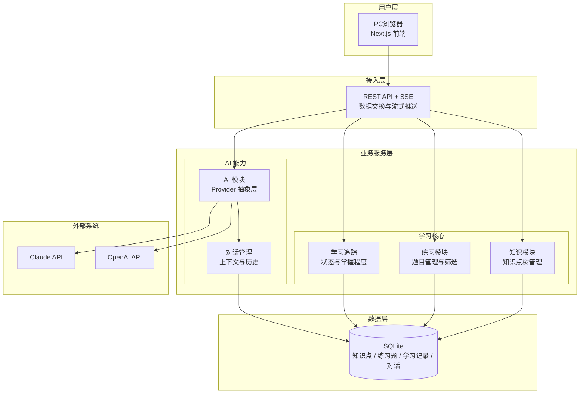
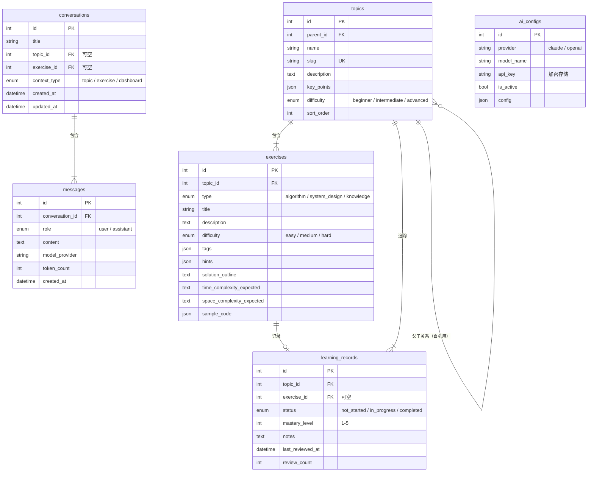
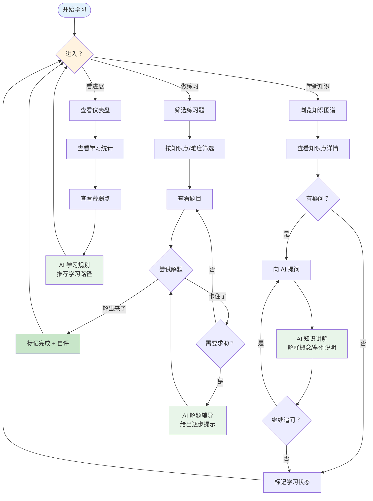
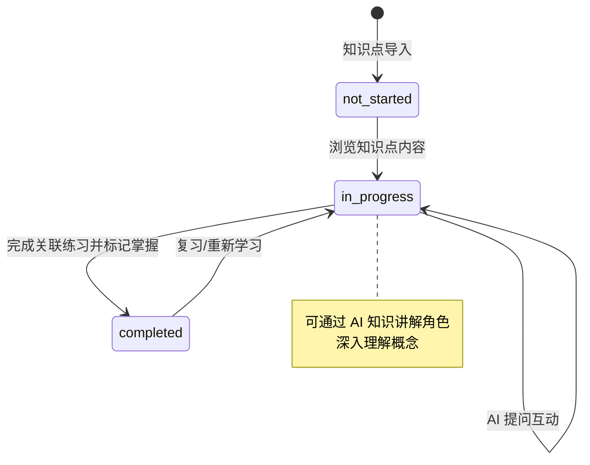
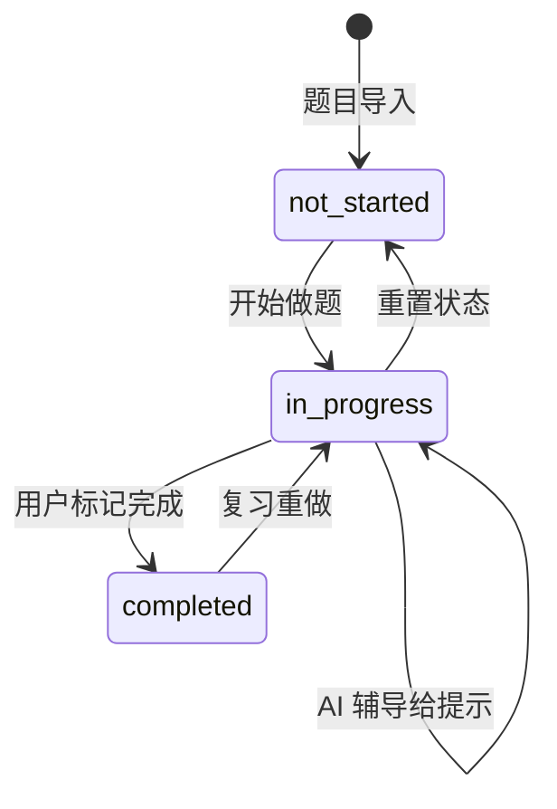
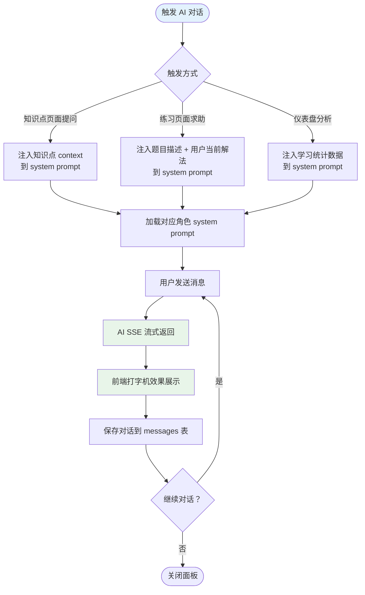
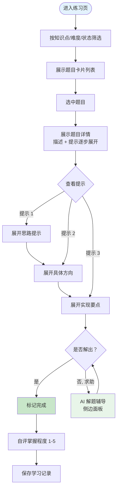

# Learn Helper PRD

| PRD 审核人 | [TODO: 待填写] |
| --- | --- |
| 重要性 | 中 |
| 紧迫性 | 中 |
| 需求方 | 个人 |
| PRD 编写人 | [TODO: 待填写] |
| PRD 提交日期 | 2026-05-28 |

## PRD 修改记录

| 变更时间 | 变更内容 | 变更提出部门与理由 | 修改人 | 审核人 | 版本号 |
| --- | --- | --- | --- | --- | --- |
| 2026-05-28 | 初始版本 | — | [TODO: 待填写] | [TODO: 待填写] | v1.0 |

---

## 1、项目背景

### 1.1 业务现状

> 💡 **方法论提示**：采用《决胜B端》三层业务调研框架进行分析。

**战略层**：软件工程师在面试准备过程中，普遍面临"知识点零散、缺乏体系化学习路径、刷题效率低"的痛点。现有方案（LeetCode、牛客网、八股文网站）要么是纯刷题工具，要么是零散的知识文章，缺少一个将"知识学习 + AI 辅导 + 练习巩固 + 薄弱分析"整合在一起的系统性学习助手。

**战术层**：数据结构和算法是软件工程师面试的核心考核内容，但学习者往往：
- 看完知识点但无人可问，理解浮于表面
- 刷题遇到卡点只能看题解，缺少循序渐进的解题引导
- 不知道自己哪些知识点薄弱，学完就忘

**执行层**：当前无任何辅助系统，学习过程完全依赖个人自觉和零散资料。

### 1.2 面临问题

1. **知识点分散、不成体系**：现有学习资料（博客、视频、刷题网站）各自独立，缺乏统一的、树状组织的知识体系，导致学习路径混乱。
2. **缺少个性化辅导**：遇到理解卡点时，没有可以随时提问的"老师"，看题解容易被剧透答案，丧失思考过程。
3. **学习效果难以追踪**：不知道自己掌握了多少、薄弱点在哪，复习计划全靠直觉。
4. **刷题效率低**：卡在某一题时，缺少引导式的提示系统，容易陷入长时间死磕或直接放弃。

### 1.3 解决思路

构建 Learn Helper —— 一个以**知识体系树为核心**、**AI 三角色辅导**为特色的个人学习助手：
- 知识模块：以树状结构组织数据结构与算法知识点，锚定学习路径
- AI 模块：三种角色（知识讲解 / 解题辅导 / 学习规划）覆盖从理解到巩固的全流程
- 练习模块：题目关联知识点，逐题追踪掌握程度
- 学习追踪：仪表盘展示学习进度和薄弱点，指导下一步学习

### 1.4 决策依据

- 数据结构和算法是软件工程师面试的**高频必考领域**，覆盖面广、知识点层深，适合体系化学习
- 零散刷题的痛点广泛存在，但市场缺少本文将**知识体系 × AI 辅导 × 进度追踪**三者有机整合的产品
- 单用户本地架构零运维成本，适合个人快速启动验证，做出来即用
## 2、需求基本情况

| 要素 | 内容 |
| --- | --- |
| **需求提出人** | 个人开发者（用户本人） |
| **功能使用人** | 软件工程师（用户本人），正在准备技术面试或系统性补基础 |
| **受影响人** | 无（单用户自用，不涉及多角色协作） |
| **场景描述** | 见下方详细场景 |
| **发生频率** | 每周 3-7 次，每次 30-120 分钟 |
| **核心痛点** | 软件工程师在学习数据结构与算法时，知识点散乱、遇到卡点无人可问、学了就忘，缺少体系化的学习闭环 |
| **需求价值** | 将"知识学习 → AI互动理解 → 练习巩固 → 薄弱分析 → 复习规划"串成一条完整的学习链路，提升学习效率和知识留存率 |

### 核心场景描述

> 💡 **方法论提示**：采用场景六要素（人物、时间、地点、起因、经过、结果）描述。

**场景 1：体系化知识点学习**
- **人物**：软件工程师（用户），有面试或补基础的诉求
- **时间**：工作日晚上或周末
- **地点**：个人电脑前
- **起因**：想学习"二叉树"相关知识点，但不确定该从哪开始，以及学完之后怎么验证掌握程度
- **经过**：打开 Learn Helper → 进入知识图谱页，看到从"数据结构 → 树 → 二叉树 → BST → AVL"的完整路径 → 点击"二叉树"查看概念讲解和要点 → 有疑问时点击"向 AI 提问"，AI 解释概念并举例
- **结果**：在体系化的引导下，清晰理解知识点的位置和关联，疑问即时得到解答

**场景 2：解题辅导**
- **人物**：软件工程师（用户）
- **时间**：学习完某个知识点后
- **地点**：个人电脑前
- **起因**：看完"二叉树"的概念，想通过实战检验理解程度
- **经过**：进入练习页 → 筛选"二叉树"相关题目 → 选中一道 Medium 题 → 尝试解题卡住了 → 点击"求助 AI"，AI 给出逐步提示而非答案 → 根据提示继续尝试
- **结果**：在引导下独立解出题目，对知识点的理解更扎实，避免了直接看答案的"无效学习"

**场景 3：学习复盘与规划**
- **人物**：软件工程师（用户）
- **时间**：每周学习结束后
- **地点**：个人电脑前
- **起因**：学了一周，想知道自己哪些知识点掌握得好、哪些还需要补
- **经过**：打开仪表盘 → 查看学习统计（已学知识点数、练习正确率、薄弱点分布）→ AI 学习规划角色分析数据 → 推荐下一步学习路径和复习计划
- **结果**：清晰了解自己的学习进展和薄弱环节，获得有针对性的下一阶段建议

## 3、需求分析与方案对比

> 鉴于本项目为个人工具，本章调整为对个人学习需求的分析和现有方案的对比评估。

### 3.1 个人学习需求分析

| 分析维度 | 内容 |
| --- | --- |
| **目标用户** | 软件工程师（个人），正在准备技术面试或系统性补基础 |
| **学习目标** | 掌握数据结构与算法的核心知识体系，能应对技术面试 |
| **学习习惯** | 每周 3-7 次，每次 30-120 分钟，以自学为主 |
| **核心诉求** | 系统化的知识体系、遇到卡点时有引导而非直接看答案、能追踪自己的掌握程度 |
| **当前痛点** | 知识点零散、学习路径不清晰、刷题效率低、不知道弱点在哪 |

### 3.2 现有方案对比

| 对比维度 | LeetCode | 牛客网 | 八股文网站/博客 | Learn Helper |
| --- | --- | --- | --- | --- |
| **核心能力** | 刷题 + 题解 | 刷题 + 面经 | 知识文章整理 | **体系化学习 + AI 辅导** |
| **知识体系** | 按标签归类 | 按公司/岗位 | 零散文章 | **树状知识体系** |
| **AI 辅导** | ❌ | ❌ | ❌ | **三角色（讲解/辅导/规划）** |
| **引导式解题** | ❌（直接看题解） | ❌ | ❌ | **逐步提示而非答案** |
| **学习追踪** | 做题统计 | 做题统计 | ❌ | **薄弱点分析 + 复习推荐** |
| **学习闭环** | 刷题 → 看题解 | 刷题 → 看面经 | 看 → 忘 | **学 → 问 → 练 → 分析 → 复习** |

### 3.3 Learn Helper 的差异化价值

> 💡 **方法论提示**：基于"知识体系化 + AI 引导式辅导"的双重差异化定位。

1. **不仅要刷题，更要建立知识体系**：以树状知识图谱组织内容，每道题关联到具体知识点，让学习有明确的上下文和路径。
2. **AI 不是给答案的，是引导思考的**：三种角色精准分工，解题辅导模式给提示不给答案，保护用户的思考过程。
3. **学习可追踪、可复盘**：每道题、每个知识点都记录掌握程度，仪表盘清晰展示薄弱点，AI 推荐下一步。
4. **零配置、零运维**：单用户本地架构，SQLite 持久化，开箱即用。

## 4、项目收益目标

> 💡 **方法论提示**：个人工具型项目，收益目标评估聚焦在**个人学习效率提升**而非商业 ROI。

### 4.1 个人学习效率目标

| 指标 | 当前状态 | 目标状态 | 评估方式 |
| --- | --- | --- | --- |
| 知识体系完整度 | 零散，无系统框架 | 能按树状结构清晰描述数据结构和算法全貌 | 知识图谱完成度（知识点数） |
| 单知识点掌握深度 | 看过就忘，理解浅 | 能用自己的话解释概念 + 独立完成关联练习题 | 掌握程度评级 (1→5) |
| 解题效率 | 卡题时耗时长或直接看答案 | 通过 AI 引导式提示独立解出中等难度题 | 解题完成率 / 求助次数 |
| 薄弱点识别 | 凭感觉判断 | 基于数据清晰知道薄弱知识点 | 仪表盘数据趋势 |
| 学习持续性 | 无复习机制，容易遗忘 | 间隔重复提醒，定期巩固已学知识 | 复习完成率 |

### 4.2 个人成功标准

| 优先级 | 成功标准 | 验收方式 |
| --- | --- | --- |
| P0 | 能完成一个知识点的完整学习闭环（浏览→提问→练习→标记掌握） | 完整走通一个知识点流程 |
| P0 | AI 三角色都能正常对话（知识讲解 / 解题辅导 / 学习规划） | 三种角色各测试一次 |
| P1 | 内置题库覆盖主要数据结构和算法知识点 | 统计题目数量和知识点覆盖率 |
| P1 | 仪表盘能显示准确的学习统计数据 | 手动验证数据一致性 |
| P2 | 间隔重复复习提醒功能正常 | 模拟使用后验证提醒触发 |

## 5、项目方案概述

### 5.1 核心功能概述

| 序号 | 功能模块 | 功能简述 | 优先级 |
| --- | --- | --- | --- |
| 1 | 知识图谱 | 树状结构展示数据结构与算法的知识点层级，支持展开/折叠浏览和知识点详情查看 | P0 |
| 2 | AI 知识讲解 | 用户浏览知识点时提问，AI 扮演老师角色解释概念、举例说明、回答追问 | P0 |
| 3 | AI 解题辅导 | 用户做题卡住时求助，AI 给出逐步提示而非直接答案，引导思考 | P0 |
| 4 | AI 学习规划 | 基于学习数据分析薄弱点，推荐学习路径和复习计划 | P1 |
| 5 | 练习题库 | 题目关联知识点，支持按知识点/难度/状态筛选，包含算法、系统设计、八股文三类 | P0 |
| 6 | 学习追踪 | 记录每题/每知识点的状态和掌握程度 | P1 |
| 7 | 仪表盘 | 展示学习统计、薄弱点提示、复习提醒 | P1 |
| 8 | AI 侧边对话面板 | 全局 AI 对话以侧边面板形式呈现，不离开当前页面，打字机流式效果 | P0 |
| 9 | 设置页 | AI 模型配置（Provider/Model/API Key）、主题切换 | P1 |

### 5.2 方案概述

- **产品方案**：以知识体系树为核心组织学习内容，AI 三角色（讲解/辅导/规划）覆盖学→练→复盘全链路，轻量单用户本地架构，开箱即用。
- **技术方案**：Next.js 15 (App Router) + Tailwind CSS / shadcn/ui 前端，Go 1.22+ + Chi router 单体后端，SQLite 持久化，REST + SSE 通信。
- **迭代方案**：第一期聚焦数据结构与算法知识体系 + 内置题库 + AI 三角色 + 学习进度追踪，单用户无登录。

### 5.3 第一期范围（MVP）

**包含的功能：**
| 模块 | 包含内容 | 理由 |
| --- | --- | --- |
| 知识图谱 | 数据结构与算法知识点树状结构 + 详情展示 | 学习的基础载体 |
| AI 对话 | 知识讲解 + 解题辅导两种角色，侧边面板 + SSE 流式输出 | 核心差异化价值 |
| 练习模块 | 内置题库（算法为主），关联知识点，状态标记 | 巩固手段 |
| 学习追踪 | 基本统计（已学/已练/掌握程度） | 闭环的必要环节 |

**暂不包含的功能：**
| 功能 | 延后理由 |
| --- | --- |
| AI 学习规划角色（仪表盘推荐） | 需要积累足够学习数据后才有分析价值 |
| 间隔重复复习提醒 | 第二期完善 |
| 系统设计 / 八股文题库深度建设 | 第一期先夯实算法，第二期扩展 |
| 主题切换 | 非核心功能，低优先级 |

## 6、项目范围

### 6.1 业务范围

| 维度 | 范围内 | 范围外 |
| --- | --- | --- |
| 知识领域 | 数据结构与算法 | 其他领域（操作系统、网络、数据库等）——第二期 |
| 题目类型 | 算法题为主，少量系统设计和八股文 | 深度系统设计 + 大量八股文——第二期 |
| AI 角色 | 知识讲解 + 解题辅导（MVP），学习规划（P1） | 代码审查角色、模拟面试角色——后续版本 |
| 用户系统 | 单用户，无登录 | 多用户、登录注册——暂不规划 |
| 部署方式 | 本地运行（dev server + Go 后端） | 云端多租户部署——暂不规划 |

### 6.2 功能清单

| 模块 | 功能点 | 优先级 | 说明 |
| --- | --- | --- | --- |
| 知识图谱 | 树状知识点展示 | P0 | 可展开/折叠 |
|  | 知识点详情页面 | P0 | 概念、要点、关联练习 |
|  | 学习状态标记 | P1 | 标记已掌握/需复习 |
| AI 对话 | 侧边对话面板 | P0 | 不离开当前页面 |
|  | SSE 流式输出 | P0 | 打字机效果 |
|  | 关联知识点上下文 | P0 | 自动注入 system prompt |
|  | 对话历史持久化 | P0 | 存储完整对话记录 |
|  | 知识讲解角色 | P0 | 浏览知识点时提问 |
|  | 解题辅导角色 | P0 | 做题时给提示 |
|  | 学习规划角色 | P1 | 仪表盘推荐 |
|  | 多模型切换 | P1 | Claude/OpenAI |
| 练习模块 | 题目关联知识点 | P0 | 按知识点筛选 |
|  | 按难度/状态筛选 | P0 | easy/medium/hard + 已完成/未完成 |
|  | 提示逐步展开 | P0 | 从思路提示到具体提示 |
|  | 标记完成 + 自评 | P0 | 掌握程度 1-5 评分 |
|  | 个人笔记 | P2 | 每道题/知识点记录笔记 |
| 仪表盘 | 学习统计数据 | P1 | 总量、趋势 |
|  | 薄弱点展示 | P1 | 基于掌握程度分析 |
|  | AI 学习推荐 | P1 | 学习规划角色输出 |
| 设置 | AI 模型配置 | P1 | Provider/Model/API Key |
|  | 主题切换 | P2 | 亮/暗主题 |

## 7、项目风险

| 风险项 | 风险等级 | 描述 | 应对措施 |
| --- | --- | --- | --- |
| AI 接口不稳定 | 中 | 依赖第三方 AI API（Claude/OpenAI），API 可能超时、限流或变更 | Provider 抽象层支持多模型切换；关键交互（如知识点浏览）可有离线降级 |
| AI 输出质量不可控 | 中 | 解题辅导角色可能直接给出答案，违背引导式设计初衷 | System prompt 工程约束 + 输出后处理校验；预留"屏蔽答案"配置开关 |
| 单机数据丢失 | 低 | SQLite 文件损坏或误删导致学习数据丢失 | 提供 SQLite 导出/备份机制；数据模型设计支持重建（种子数据可重跑） |
| 个人动力不足 | 低 | 学习类产品用户天然有弃用风险 | 仪表盘可视化学习进展正向激励；间隔重复提醒保持使用频率 |

## 8、术语与参考文献

### 8.1 术语表

| 术语 | 说明 |
| --- | --- |
| 知识点 (Topic) | 知识体系中一个独立的学习单元，如"二叉树"、"二分查找" |
| 练习题 (Exercise) | 关联到具体知识点的巩固题目 |
| 掌握程度 (Mastery Level) | 用户自行评定的 1-5 级掌握等级 |
| SSE | Server-Sent Events，服务端推送流式数据到前端 |
| Provider | AI 模型提供商抽象层（Claude / OpenAI 等） |
| 学习记录 (Learning Record) | 用户对知识点的学习状态追踪 |

### 8.2 参考文献

| 来源 | 内容 |
| --- | --- |
| 设计文档 | docs/superpowers/specs/2026-05-27-learn-helper-design.md |
| AI 接口 | Anthropic API / OpenAI API 官方文档 |
| 前端框架 | Next.js 15 (App Router) 官方文档 |
| UI 组件 | shadcn/ui 组件库 |
| Go 后端 | Chi router 文档 + sqlc 文档 |
## 9、附录
（本章预留，后续补充）

---

## 10、功能需求

### 10.1 产品框架概述

#### 10.1.1 应用架构图



> 💡 **方法论提示**：采用五层架构设计（用户层 → 接入层 → 业务服务层 → 数据层 → 外部系统），AI Provider 通过抽象层屏蔽不同模型供应商的差异。
#### 10.1.2 数据模型图



**实体说明：**

| 实体 | 说明 | 核心字段说明 |
| --- | --- | --- |
| `topics` | 知识点 | 树状结构自引用（parent_id），slug 做 URL 标识 |
| `exercises` | 练习题 | 关联到知识点（topic_id），hints 为分层提示列表 |
| `learning_records` | 学习记录 | 可关联知识点或具体题目，mastery_level 1~5 自评 |
| `conversations` | AI 对话会话 | 关联到具体上下文（知识点/题目/仪表盘） |
| `messages` | 对话消息 | 用户或 AI 消息，记录 token 消耗 |
| `ai_configs` | AI 模型配置 | 支持多 Provider 多模型切换 |

> 💡 **方法论提示**：采用 ER 建模三步法——找实体（6 个核心实体）→ 梳关系（一对多、自引用）→ 定属性（关键字段 + 枚举约束）。
#### 10.1.3 核心使用流程图



**流程说明：**

| 阶段 | 关键动作 | 涉及角色 |
| --- | --- | --- |
| 知识学习 | 浏览知识点 → 查看详情 → AI 提问 | 用户 + AI（知识讲解） |
| 练习巩固 | 筛选题目 → 解题 → AI 辅导 | 用户 + AI（解题辅导） |
| 复盘规划 | 查看统计 → 薄弱分析 → AI 推荐 | 用户 + AI（学习规划） |

#### 10.1.4 状态机图

**知识点学习状态机：**



**练习状态机：**


**状态转换明细：**

| 当前状态 | 触发事件 | 目标状态 | 操作角色 | 备注 |
| --- | --- | --- | --- | --- |
| `not_started` | 浏览知识点内容 | `in_progress` | 用户 | 进入学习 |
| `in_progress` | AI 提问互动 | `in_progress` | 用户 + AI | 多次交互不改变状态 |
| `in_progress` | 完成关联练习 + 自评 | `completed` | 用户 | 掌握程度 >= 3 建议标记完成 |
| `completed` | 复习/重学 | `in_progress` | 用户 | 间隔重复触发 |
| `not_started` | 开始做题 | `in_progress` | 用户 | — |
| `in_progress` | AI 辅导 | `in_progress` | 用户 + AI | 多次辅导不改变状态 |
| `in_progress` | 标记完成 | `completed` | 用户 | 需自评掌握程度 |
| `completed` | 复习重做 | `in_progress` | 用户 | 重置掌握程度 |
| `in_progress` | 重置状态 | `not_started` | 用户 | 清空进度 |

#### 10.1.5 功能清单

| 子系统 | 页面 | PC 端 | 说明 |
| --- | --- | --- | --- |
| 知识模块 | `/learn` | ✓ | 知识图谱页，左侧树导航 + 右侧详情 |
| 知识模块 | `/learn/:topicSlug` | ✓ | 知识点详情页 + AI 对话侧边面板 |
| 练习模块 | `/practice` | ✓ | 练习题列表 + 筛选 |
| 练习模块 | `/practice/:id` | ✓ | 做题页 + AI 辅导面板 |
| 仪表盘 | `/dashboard` | ✓ | 学习统计 + 薄弱点 + AI 推荐 |
| 设置 | `/settings` | ✓ | AI 配置 + 主题设置 |
| 通用 | AI 对话侧边面板 | ✓ | 所有页面均可呼出，不离开当前页 |

### 10.2 产品需求详解

#### 10.2.1 知识模块

##### 10.2.1.1 业务流程图

```mermaid
flowchart TD
    START([进入知识图谱]) --> LOAD[加载知识点树]
    LOAD --> TREE[左侧展示树状导航]
    TREE --> CLICK[点击知识点节点]
    CLICK --> DETAIL[右侧加载知识点详情<br/>概念 / 要点 / 关联练习]

    DETAIL --> MARK[标记学习状态]
    DETAIL --> ASK[点击"向 AI 提问"]

    ASK --> PANEL[打开侧边对话面板<br/>自动注入知识点上下文]
    PANEL --> Q[用户输入问题]
    Q --> AI[AI 知识讲解角色<br/>SSE 流式返回]
    AI --> Q

    MARK --> DONE{状态变更？}
    DONE -->|not_started → in_progress| UPD1[更新学习记录]
    DONE -->|in_progress → completed| UPD2[更新掌握程度]

    style START fill:#E3F2FD
    style AI fill:#E8F5E9
```

##### 10.2.1.2 页面交互

**知识图谱页（`/learn`）**

| 区域 | 内容 | 交互说明 |
| --- | --- | --- |
| 左侧导航 | 知识点树状结构 | 可展开/折叠子节点；点击切换右侧内容；高亮当前选中节点 |
| 右侧详情 | 选中知识点的概念描述、关键要点、关联练习题列表 | 若未选中节点，显示欢迎/引导信息 |
| 顶部栏 | 学习进度概览 | 已学 / 总数百分比 |

**知识点详情页（`/learn/:topicSlug`）**

| 要素 | 说明 |
| --- | --- |
| 知识点名称 | 展示名称和难度标签 |
| 概念描述 | Markdown 格式渲染 |
| 关键要点 | 列表展示，每个要点可展开 |
| 关联练习题 | 列出关联题目，点击跳转 `/practice/:id` |
| 学习状态 | 标记按钮：not_started / in_progress / completed 切换 |
| 提问按钮 | "向 AI 提问"→ 打开侧边对话面板 |

##### 10.2.1.3 业务规则

| 编号 | 规则类型 | 规则描述 |
| --- | --- | --- |
| R01 | 约束 | 知识点 slug 唯一，生成后不可修改 |
| R02 | 约束 | 一个知识点只能有一个父节点（单父树结构） |
| R03 | 触发器 | 当用户浏览知识点超过 30 秒时，自动创建/更新 `learning_records` 状态为 `in_progress` |
| R04 | 推论 | 子知识点全部标记为 `completed` 时，父知识点可推荐复习 |
| R05 | 计算 | 知识点掌握程度 = min(自评掌握程度, 关联练习平均掌握程度) |
#### 10.2.2 AI 对话模块

##### 10.2.2.1 业务流程图



##### 10.2.2.2 AI 功能设计

> 💡 **方法论提示**：采用"确定性-容错性四象限"分析 + "六脉神剑交互模式"选择。

**任务特征分析：**

| 分析维度 | 知识讲解 | 解题辅导 | 学习规划 |
| --- | --- | --- | --- |
| 确定性 | 中（回答需准确但可举例发挥） | 中（需引向正确方向但不给答案） | 中高（基于数据分析做推荐） |
| 容错性 | 中低（概念不能讲错） | 中（提示方向稍偏可接受） | 中（推荐不准确用户可忽略） |
| 推荐交互模式 | Chat（自由对话） | Chat + 辅助填充（结构化提示） | CUI 嵌入 GUI（数据驱动） |

**AI 交互设计：**
- **交互模式**：Chat（CUI 嵌入 GUI）—— 侧边对话面板作为 GUI 内的文字交互界面
- **人机边界**：
  - AI 执行：概念解释、引导提示、学习推荐
  - 人必须操作：标记掌握程度、决定学习路径、判断提示是否足够
  - AI 不能做：直接给出答案（解题辅导模式屏蔽）
- **降级方案**：AI 请求超时/失败时，显示"AI 暂时不可用，请稍后重试"；知识点浏览和练习不依赖 AI 可独立使用

##### 10.2.2.3 页面交互

**AI 侧边对话面板（全局通用）**

| 要素 | 说明 |
| --- | --- |
| 触发方式 | 每个页面内的"向 AI 提问"/"求助 AI"按钮 |
| 面板位置 | 从右侧滑入，不覆盖全部页面内容，宽度 ~400px |
| 面板头部 | 当前角色名称（知识讲解/解题辅导/学习规划）+ 关闭按钮 |
| 消息区域 | 用户消息右对齐，AI 消息左对齐，打字机流式输出效果 |
| 输入区域 | 文本输入框 + 发送按钮，支持 Enter 发送 |
| 对话历史 | 保留完整对话，支持回看；页面内切换不影响对话 |

**对话上下文注入规则：**

| 触发场景 | 注入 context |
| --- | --- |
| 从 `/learn/:slug` 打开 | 当前知识点名称、描述、关键要点 |
| 从 `/practice/:id` 打开 | 题目标题、描述、用户已输入的解法（如有） |
| 从 `/dashboard` 打开 | 学习统计数据、薄弱知识点列表 |

##### 10.2.2.4 业务规则

| 编号 | 规则类型 | 规则描述 |
| --- | --- | --- |
| R06 | 约束 | 解题辅导角色 system prompt 必须包含"不要直接给出答案，只能给提示"的约束 |
| R07 | 约束 | 单次对话 token 超限时，自动摘要压缩早期消息 |
| R08 | 触发器 | 新对话首次发送消息时自动创建 conversation 记录 |
| R09 | 触发器 | 每次 AI 回复完成后自动计算并记录 token_count |
| R10 | 计算 | 每次对话加载时，从关联 topic/exercise 的当前状态注入上下文 |

> 💡 **方法论提示**：规则设计采用五种类型分类——约束（R06/R07）、触发器（R08/R09）、计算（R10）。
#### 10.2.3 练习模块

##### 10.2.3.1 业务流程图



##### 10.2.3.2 页面交互

**练习页（`/practice`）**

| 查询条件 | 默认值 | 字段类型 | 备注 |
| --- | --- | --- | --- |
| 知识点 | 全部 | 下拉树选择 | 从 topics 树加载 |
| 难度 | 全部 | 下拉 | easy / medium / hard |
| 状态 | 全部 | 下拉 | not_started / in_progress / completed |

| 列表字段 | 说明 | 操作 |
| --- | --- | --- |
| 题目标题 | 点击进入详情 | 跳转 `/practice/:id` |
| 类型标签 | algorithm / system_design / knowledge | — |
| 难度标签 | easy / medium / hard（颜色区分） | — |
| 状态 | 掌握程度或"未开始" | 可快速切换 |

**练习详情页（`/practice/:id`）**

| 要素 | 说明 |
| --- | --- |
| 题目描述 | Markdown 渲染，含示例输入/输出 |
| 提示区域 | 逐步展开，点击"查看提示 1"→"提示 2"→"提示 3" |
| 解题思路概要 | 题目自带的 solution_outline，可展开/收起 |
| 求助按钮 | "求助 AI"→ 打开 AI 解题辅导面板 |
| 标记完成 | 点击后弹出掌握程度评分（1-5） |
| 笔记区域 | 自由文本，记录个人解题思路 |

##### 10.2.3.3 业务规则

| 编号 | 规则类型 | 规则描述 |
| --- | --- | --- |
| R11 | 事实 | 每道题有 type（algorithm/system_design/knowledge）分类 |
| R12 | 约束 | 同一知识点下的题目数量 >= 1 |
| R13 | 触发器 | 用户点击"标记完成"时，必须选择掌握程度（1-5）才能保存 |
| R14 | 计算 | 知识点掌握程度 = 该知识点下所有已标记题目的掌握程度平均值 |
| R15 | 约束 | 提示（hints）必须逐步展开，不能一次性全部展示 |

#### 10.2.4 仪表盘模块

##### 10.2.4.1 页面交互

**仪表盘（`/dashboard`）**

| 区域 | 内容 | 说明 |
| --- | --- | --- |
| 概览卡片 | 已学知识点 / 已练习题数 / 整体掌握率 | 总览数字 + 趋势箭头 |
| 掌握程度分布 | 柱状图/饼图，展示各掌握程度比例 | 按 learning_records.mastery_level 聚合 |
| 知识点覆盖 | 树状图展示已学 vs 未学知识点 | 绿色=已掌握 / 黄色=学习中 / 灰色=未开始 |
| 薄弱点列表 | 掌握程度最低的 5 个知识点 | 按 mastery_level 升序排列 |
| AI 学习规划 | "让 AI 分析"→ 触发学习规划角色 | 基于当前数据分析并推荐下一步 |
| 复习提醒 | 长期未复习的知识点 | 超过 7 天未 review 的知识点 |

##### 10.2.4.2 业务规则

| 编号 | 规则类型 | 规则描述 |
| --- | --- | --- |
| R16 | 计算 | 整体掌握率 = 所有知识点掌握程度平均值（未开始记为 0） |
| R17 | 触发器 | 当某个知识点超过 7 天未 review 且已标记完成时，显示复习提醒 |
| R18 | 触发器 | 薄弱点列表每天首次加载时自动计算 |
| R19 | 约束 | AI 学习规划触发时，必须有至少 5 条学习记录，否则提示数据不足 |
### 10.3 异常情况处理方案

| 异常类型 | 异常场景 | 处理方案 |
| --- | --- | --- |
| 网络异常 | AI API 请求超时/断网 | 前端显示"AI 暂时不可用，请稍后重试"；知识点浏览和练习不依赖 AI，可正常使用 |
| API 限流 | AI 请求频率过高被限流 | 后端实现指数退避重试（最多 3 次）；前端显示"请求过于频繁，请稍后" |
| 数据异常 | AI 返回格式异常（非预期结构） | 前端容错解析，若解析失败显示"AI 回复异常，建议重试" |
| 误操作 | 误标记知识点为完成 | 支持随时切换回 `in_progress` 或 `not_started` 状态，无不可逆操作 |
| 数据丢失 | SQLite 文件损坏 | 提供数据库导出功能以支持备份，定期备份可手动配置 |
| AI 输出违规 | 解题辅导角色直接给出了答案 | 后端 post-process 检测关键词，拦截并提示"请将问题拆解为提示" |
| Token 耗尽 | 长对话 token 超限 | 自动摘要压缩早期消息并入 system prompt，继续对话 |

## 11、数据埋点

> 个人工具的数据埋点主要用于自我使用分析，帮助优化学习体验和追踪使用习惯。

### 11.1 页面埋点

| 页面 | 事件名称 | 事件类型 | 采集参数 | 用途说明 |
| --- | --- | --- | --- | --- |
| 知识图谱页 | `page_view_learn` | 页面曝光 | 无 | 监控学习入口使用频率 |
| 知识点详情页 | `page_view_topic` | 页面曝光 | topic_slug, topic_name | 分析哪些知识点最常被浏览 |
| 练习列表页 | `page_view_practice` | 页面曝光 | 筛选条件 | 监控练习入口使用频率 |
| 练习详情页 | `page_view_exercise` | 页面曝光 | exercise_id, topic_id | 分析哪些题目被练习 |
| 仪表盘 | `page_view_dashboard` | 页面曝光 | 无 | 监控复盘频率 |
| 设置页 | `page_view_settings` | 页面曝光 | 无 | 监控配置变更频率 |

### 11.2 行为埋点

| 操作 | 事件名称 | 触发条件 | 采集参数 | 用途说明 |
| --- | --- | --- | --- | --- |
| 展开知识点 | `topic_expand` | 展开树节点 | topic_slug | 分析知识点导航行为 |
| AI 提问 | `ai_ask_question` | 发送 AI 消息 | role_type（讲解/辅导/规划） | 分析 AI 使用频率和角色分布 |
| AI 回复完成 | `ai_response_complete` | SSE 流式接收完成 | token_count, duration_ms | 分析 AI 响应时间与成本 |
| 标记完成 | `exercise_complete` | 点击标记完成 | exercise_id, mastery_level | 分析掌握程度分布 |
| 查看提示 | `hint_view` | 展开提示层级 | exercise_id, hint_level | 分析题目难易与提示需求 |
| 查看薄弱点 | `weakness_view` | 加载仪表盘薄弱点 | 无 | 监控复盘行为 |
| 触发 AI 学习规划 | `ai_plan_trigger` | 点击"让 AI 分析" | 无 | 监控学习规划使用率 |

### 11.3 业务指标

| 指标名称 | 计算方式 | 数据来源 | 统计周期 |
| --- | --- | --- | --- |
| 日学习时长 | 当日浏览知识点 + 练习的总时长 | `learning_records` + 日志 | 日 |
| AI 使用次数 | 当日 AI 消息发送数量 | `messages` 表 | 日 |
| 知识点完成率 | `completed` 知识点数 / 总知识点数 | `learning_records` | 实时 |
| 练习完成率 | `completed` 题目数 / 总题目数 | `learning_records` | 实时 |
| 平均掌握程度 | 所有 `mastery_level` 平均值 | `learning_records` | 实时 |
| 薄弱知识点数 | `mastery_level < 3` 的知识点数 | `learning_records` | 实时 |
## 12、角色和权限

### 12.1 角色定义

| 角色名称 | 角色说明 | 权限范围 |
| --- | --- | --- |
| 用户（本人） | 系统唯一使用者 | 全部功能（管理 + 使用） |

### 12.2 权限说明

> 本项目为单用户无登录系统，**不存在多角色权限问题**。所有功能对用户完全开放，不设权限控制。

| 功能 | 权限 |
| --- | --- |
| 浏览知识图谱 | ✓ |
| 查看知识点详情 | ✓ |
| 向 AI 提问（所有角色） | ✓ |
| 浏览和筛选练习题 | ✓ |
| 查看练习详情 | ✓ |
| 标记完成 + 自评 | ✓ |
| 查看仪表盘 | ✓ |
| AI 学习规划 | ✓ |
| 设置 AI 模型配置 | ✓ |
| 管理数据库（导出/备份） | ✓ |

## 13、迭代计划

### 13.1 版本计划

| 阶段 | 时间 | 范围 | 目标 |
| --- | --- | --- | --- |
| MVP | 第一期 | 数据结构与算法知识体系 + 内置题库 + AI 三角色（完成前两个）+ 基本学习追踪 | 跑通完整学习闭环 |
| V1.1 | 第一期补充 | AI 学习规划角色 + 仪表盘薄弱点分析 + 复习提醒 | 完善复盘和推荐 |
| V2.0 | 第二期 | 扩展知识领域（操作系统 / 网络 / 数据库）+ 扩种题库 | 扩大覆盖面 |
| V2.1 | 持续迭代 | 个人笔记、主题切换、数据导出等体验优化 | 提升使用体验 |

### 13.2 自用反馈与迭代

| 流程 | 说明 |
| --- | --- |
| 使用反馈 | 边用边改，无正式反馈流程 |
| 问题收集 | 自己遇到 bug 或体验问题时，直接修复 |
| 功能优先级 | 按自己的实际学习需求驱动，想学什么就先完善什么 |
| 数据备份 | 定期导出 SQLite 文件备份 |

## 14、待决事项

| 编号 | 待决事项 | 涉及章节 | 当前状态 |
| --- | --- | --- | --- |
| TBD-1 | 第一期先做 Claude 还是 OpenAI 的 Provider？或者两个都做？ | 第 10 章 AI 模块 | 待决定 |
| TBD-2 | 内置题库的数据来源——是自己手动录入还是让 AI 生成种子数据？ | 第 6 章 项目范围 | 待决定 |
| TBD-3 | 知识点体系的数据——第一期覆盖数据结构与算法的哪些具体知识点？（可参考常见面试大纲） | 第 1 章 项目背景 | 需定义清单 |
| TBD-4 | 对话历史超过 token 上限时的摘要压缩策略——用 AI 做摘要还是直接截断？ | 第 10 章 AI 模块 | 待调研 |
| TBD-5 | 是否需要支持本地 LLM 模型（如 Ollama）作为 AI Provider？ | 第 10 章 AI 模块 | 待决定 |

---

## 附：待完善清单

### 🔴 必须补充（影响项目启动）

1. **知识点清单未定义**：第一期数据结构与算法的具体知识点列表需要明确（例如：数组/链表/栈/队列/树/图/排序/搜索/动态规划……），这是知识体系建设的基石
2. **内置题库数量和内容未定**：每道题需要关联到具体知识点，建议先列出每个知识点下计划包含的题目数量

### 🟡 建议补充（提升 PRD 质量）

1. **AI Provider 选择**：第一期先做哪个？Claude 还是 OpenAI？还是两个都做通过配置切换？
2. **种子数据生成方式**：知识点和题目的初始数据是手动录入还是让 AI 生成？如果是 AI 生成，需要定义生成模板

### 🟢 可选完善

1. **是否支持本地模型**：如 Ollama 作为 offline 备选 Provider
2. **笔记功能**：第一期是否加入个人笔记，还是放到 V2.1
3. **数据导出格式**：SQLite 导出是否够用，还是需要 Markdown/JSON 格式导出学习数据

---

> 💡 建议优先补充🔴类内容后，即可开始 MVP 开发。
